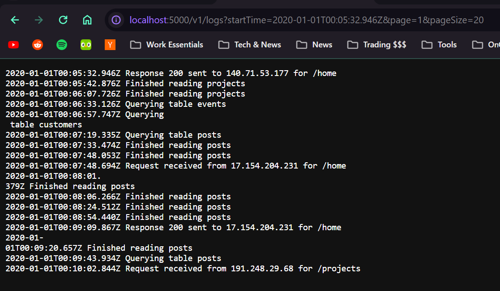

# LogEX - Explore logs with ease!!

## Dev Setup

- ASDF or NVM can be used as node version manager
  - Nodejs version v21.1.0
  - npm 10.2.0
- No deps required for running this project, but for linting and formatting purposes eslint and prettier is used
  - `npm ci`
  - `npm run format:fix` #for formatting files
  - `npm run lint:fix` #for checking eslint rules
- Logs files can be stored in `data/` dir and File PATH needs to passed using env var `LOG_FILE_PATH`
  - copy file to this path and pass `LOG_FILE_PATH` value
- few other optional env var can be passed such as
  - HOST
  - PORT
  - LOG_FILE_LINE_MAX_LENGTH defaults to 256
- dev mode can be started with
  - `npm run dev` #watches for file changes
- production mode can be started with
  - `npm start`

## APIs

### `GET /`

> Root route

### `GET /v1/health`

> Check the if the service is up?

### `GET /v1/logs`

> Logs explorer api with many options to fetch data

#### Fetching data can be done using one of following methods

- With Pagination
  - `GET` `/v1/logs?page=1&pageSize=100`
  - Max pageSize can be 500
- Without Pagination and return all data
  - `GET` `/v1/logs?skipPagination=true`
  - If data is more can face some issues based on server and client side resources
- With streaming rows
  - `GET` `/v1/logs?streamRows`
  - Streams data to client

### other filters which can be used with any of the above methods

- `startTime` - ISO date time string
- `endTime` - ISO date time string

### Few example requests

- `GET /v1/logs`
- `GET /v1/logs?page=1&pageSize=10`
- `GET /v1/logs?skipPagination=true&startTime=2020-01-01T00:05:32.946Z&endTime=2020-02-01T00:05:32.946Z`
- `GET /v1/logs?skipPagination=true&streamRows=true`
- `GET /v1/logs?startTime=2020-01-01T00:05:32.946Z&skipPagination=true&streamRows=true`
